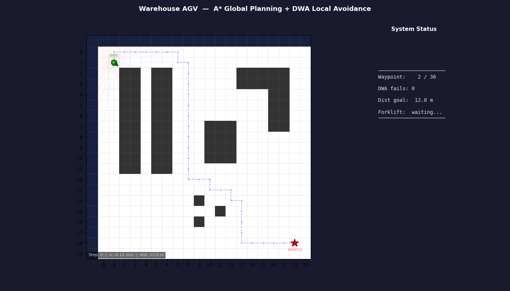

# WarehouseNav

**Autonomous robot navigation system with global/local planner architecture, simulated LiDAR, and real-time obstacle avoidance.**

[](https://github.com/davidequattrocchi10/autonomous-mobile-robot/actions/workflows/tests.yml)



*AGV navigating active warehouse — A\* global path + DWA local avoidance + forklift detection via simulated LiDAR*

---

## What This Project Demonstrates

- **Global/local planner architecture** — mirrors ROS `move_base` (A\* global + DWA local, same division of responsibility)
- **Algorithm comparison** — BFS, DFS, A\*, RRT, Q-Learning side-by-side on identical environments
- **Physical robot simulation** — differential drive kinematics, Euler integration, odometry noise
- **Sensor simulation** — step-wise ray-casting LiDAR with Gaussian noise, robot-relative beam frame

---

## Architecture

```
LiDAR scan ──────────────────────┐
                                  ▼
A* global planner ──► waypoints ──► DWA local planner ──► (v, ω) ──► Robot model
     ↑                                                                    │
     │                                                                    ▼
  static map                                                     pose (x, y, θ)
```

The global planner (A\*) computes a full collision-free path once at startup.
The local planner (DWA) runs every timestep: it reads the LiDAR scan, samples
hundreds of short trajectories, scores them on heading/clearance/velocity, and
outputs the best `(v, ω)` command while chasing the current A\* waypoint.

---

## Quick Start

```bash
git clone https://github.com/davidequattrocchi10/autonomous-mobile-robot.git
cd autonomous-mobile-robot
pip install -e .

python examples/warehouse_simulation.py   # A* + DWA warehouse demo
pytest tests/                            
```

---

## Algorithm Comparison

> Benchmark table coming soon — running controlled trials across identical scenarios.

| Algorithm  | Path Length | Nodes Explored | Time (ms) | Use Case |
|------------|-------------|----------------|-----------|----------|
| BFS        | —           | —              | —         | Shortest path, unweighted grid |
| DFS        | —           | —              | —         | Memory-efficient, non-optimal |
| A\*        | —           | —              | —         | Optimal, heuristic-guided |
| RRT        | —           | —              | —         | High-dimensional / continuous spaces |
| Q-Learning | —           | —              | —         | Unknown environment, learns online |

---

## Project Structure

```
src/
  environment/
    grid_world.py       # 2D occupancy grid, rendering, obstacle placement
    obstacle_manager.py # Dynamic obstacles: RANDOM_WALK, LINEAR, WAYPOINT modes
  planning/
    graph_search.py     # BFS, DFS, A* (clearance-aware step cost)
    rrt.py              # RRT sampling-based planner
  learning/
    q_learning.py       # Q-table, ε-greedy, Bellman update
  robot/
    robot.py            # Differential drive kinematics, odometry noise
  sensors/
    lidar.py            # Ray-casting LiDAR, N beams, Gaussian noise
  control/
    dwa.py              # Dynamic Window Approach local planner
  utils/
    conversions.py      # continuous ↔ grid coordinate conversion (single source of truth)
```

---

## Key Technical Decisions

### 1. Clearance-aware A\* via multi-source BFS

**Problem:** Standard A\* produces paths that hug obstacle walls.
A physical robot with 0.2 m radius navigating 0.5 m cells risks collisions from localization error when the planned path has zero clearance.

**Decision:** Add a `robot_radius / clearance_metres` penalty to A\*'s step cost.
A multi-source BFS (`_compute_clearance_map`) seeds all obstacle cells at distance 0 and floods outward — computing exact Manhattan clearance for every cell in one O(W×H) pass.

---

### 2. Global + local planner split

**Problem:** DWA alone aimed at the distant goal. When an obstacle blocked the direct path, every trajectory either collided or pointed away — the robot oscillated indefinitely.

**Decision:** A\* computes the full path once; DWA chases nearby A\* waypoints using a distance-based lookahead (Pure Pursuit). Advancing to the furthest waypoint within radius R means the robot starts turning earlier, producing wider arcs that don't clip corners.

**Why it works:** Same architecture as ROS `move_base` (global_planner + local_planner). DWA is not a complete navigation system on its own — it needs a global planner to give it reachable subgoals.

---

### 3. Y-downward coordinate convention throughout

**Problem:** GridWorld uses `(row, col)` with row increasing downward. Continuous space could follow standard math (y-up) or match the grid.

**Decision:** Y-downward everywhere: `θ=π/2` faces down, positive ω is clockwise.

**Why it works:** The y-flip conversion `row = grid_height - int(y/cell_size) - 1` would appear in LiDAR, DWA, robot update, and visualization — four places where a missed flip creates a silent wrong-direction bug. A single consistent convention eliminates the entire class. Also matches `matplotlib.imshow` natively.

---

## Test Coverage

```
tests/test_environment.py   26 tests
tests/test_planning.py      28 tests
tests/test_rrt.py           25 tests
tests/test_qlearning.py     31 tests
tests/test_robot.py         41 tests
tests/test_lidar.py         25 tests
tests/test_dwa.py           41 tests
─────────────────────────────────────
Total                      217 tests  ✓ all pass
```

---

🚧 **Active development** — benchmark table and emergency replanning scenario in progress