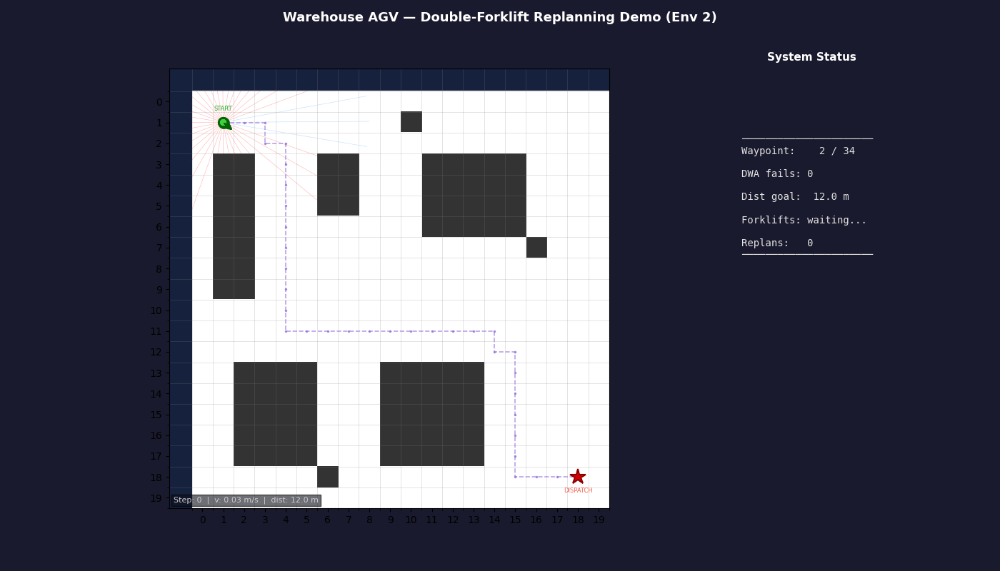

# WarehouseNav

**Autonomous robot navigation system with global/local planner architecture, simulated LiDAR, and real-time obstacle avoidance.**

[](https://github.com/davidequattrocchi10/autonomous-mobile-robot/actions/workflows/tests.yml)


*AGV navigates warehouse: A\* global path + DWA local avoidance. Forklift blocks the route →
robot stops, replans with A\*, resumes to goal.*


*Same pipeline, two forklifts moving in opposite directions. Two independent replanning events prove the mechanism generalises to any warehouse configuration.*


*AGV navigating active warehouse — A\* global path + DWA local avoidance + forklift detection via simulated LiDAR*

---

## What This Project Demonstrates

- **Global/local planner architecture** — mirrors ROS `move_base` (A\* global + DWA local, same division of responsibility)
- **Algorithm comparison** — BFS, DFS, A\*, RRT, Q-Learning side-by-side on identical environments
- **Physical robot simulation** — differential drive kinematics, Euler integration, odometry noise
- **Sensor simulation** — step-wise ray-casting LiDAR with Gaussian noise, robot-relative beam frame

---

## Architecture

```
LiDAR scan ──────────────────────┐
                                  ▼
A* global planner ──► waypoints ──► DWA local planner ──► (v, ω) ──► Robot model
     ↑                                                                    │
     │                                                                    ▼
  static map                                                     pose (x, y, θ)
```

The global planner (A\*) computes a full collision-free path once at startup.
The local planner (DWA) runs every timestep: it reads the LiDAR scan, samples
hundreds of short trajectories, scores them on heading/clearance/velocity, and
outputs the best `(v, ω)` command while chasing the current A\* waypoint.

---

## Quick Start

```bash
git clone https://github.com/davidequattrocchi10/autonomous-mobile-robot.git
cd autonomous-mobile-robot
pip install -e .

python examples/warehouse_simulation.py              # A* + DWA warehouse demo
python examples/warehouse_simulation_advanced.py     # forklift + emergency replanning
python examples/warehouse_simulation_advanced_env_two.py  # two forklifts, two replanning events
pytest tests/
```

---

## Algorithm Comparison

Benchmarked on a 20×20 grid with a wall barrier (gap at one end). Same start/goal for all algorithms.

| Algorithm  | Path Length | Nodes Explored | Time (ms) | Use Case |
|------------|-------------|----------------|-----------|----------|
| BFS        | 33          | 356            | 3.6       | Shortest path guarantee, unweighted grid |
| DFS        | 97          | 201            | 2.2       | Memory-efficient, non-optimal |
| A\*        | 33          | 237            | 6.2       | Optimal + heuristic-guided (fewer expansions than BFS) |
| RRT ¹      | 31          | 137            | 20.1      | Continuous/high-dimensional spaces — see note ² |
| Q-Learning | n/a ³       | n/a ³          | n/a ³     | Unknown environment, learns policy online |

¹ RRT path length can be shorter than BFS because it allows diagonal moves (8-connected steering), whereas BFS is 4-connected.
² RRT is included for algorithm comparison. In the warehouse pipeline, **A\* is used as global planner** — it guarantees an optimal path on a known discrete grid and is fully deterministic. RRT's strength (sampling continuous spaces without an explicit graph) is unnecessary when the map is already a 2D occupancy grid.
³ Q-Learning does not expand nodes — it trains a value table over episodes. Path quality depends on training time and environment complexity. See design note below.

> **Note on Q-Learning:** Q-Learning operates on the discrete grid (4-connected moves, full map visibility) and functions as a standalone global planner — it does **not** feed into the DWA/LiDAR/robot pipeline. This is intentional: classical planners (A\*, BFS) guarantee optimal paths in known static environments; Q-Learning's strength is learning a policy in an *unknown* environment through trial and error. Integrating Q-Learning with continuous kinematics would require Deep Q-Networks (DQN) or a policy gradient method — a natural next step for this project.

---

## Project Structure

```
src/
  environment/
    grid_world.py       # 2D occupancy grid, rendering, obstacle placement
    obstacle_manager.py # Dynamic obstacles: RANDOM_WALK, LINEAR, WAYPOINT modes
  planning/
    graph_search.py     # BFS, DFS, A* (clearance-aware step cost)
    rrt.py              # RRT sampling-based planner
  learning/
    q_learning.py       # Q-table, ε-greedy, Bellman update
  robot/
    robot.py            # Differential drive kinematics, odometry noise
  sensors/
    lidar.py            # Ray-casting LiDAR, N beams, Gaussian noise
  control/
    dwa.py              # Dynamic Window Approach local planner
  utils/
    conversions.py      # continuous ↔ grid coordinate conversion (single source of truth)
```

---

## Key Technical Decisions

### 1. Clearance-aware A\* via multi-source BFS

**Problem:** Standard A\* produces paths that hug obstacle walls.
A physical robot with 0.2 m radius navigating 0.5 m cells risks collisions from localization error when the planned path has zero clearance.

**Decision:** Add a `robot_radius / clearance_metres` penalty to A\*'s step cost.
A multi-source BFS (`_compute_clearance_map`) seeds all obstacle cells at distance 0 and floods outward — computing exact Manhattan clearance for every cell in one O(W×H) pass.

---

### 2. Global + local planner split

**Problem:** DWA alone aimed at the distant goal. When an obstacle blocked the direct path, every trajectory either collided or pointed away — the robot oscillated indefinitely.

**Decision:** A\* computes the full path once; DWA chases nearby A\* waypoints using a distance-based lookahead (Pure Pursuit). Advancing to the furthest waypoint within radius R means the robot starts turning earlier, producing wider arcs that don't clip corners.

**Why it works:** Same architecture as ROS `move_base` (global_planner + local_planner). DWA is not a complete navigation system on its own — it needs a global planner to give it reachable subgoals.

---

### 3. Y-downward coordinate convention throughout

**Problem:** GridWorld uses `(row, col)` with row increasing downward. Continuous space could follow standard math (y-up) or match the grid.

**Decision:** Y-downward everywhere: `θ=π/2` faces down, positive ω is clockwise.

**Why it works:** The y-flip conversion `row = grid_height - int(y/cell_size) - 1` would appear in LiDAR, DWA, robot update, and visualization — four places where a missed flip creates a silent wrong-direction bug. A single consistent convention eliminates the entire class. Also matches `matplotlib.imshow` natively.

---

### 4. Lookahead targeting instead of nearest-waypoint chasing

**Problem:** DWA chasing the *nearest* A\* waypoint causes the robot to slow at every grid cell and clip inside corners — the robot nearly collides with the inner wall of every turn.

**Decision:** Advance to the *furthest* waypoint within a lookahead radius R (Pure Pursuit style). The robot starts curving earlier, producing wider arcs that naturally clear corners.

**Why it works:** Same principle used in autonomous car path tracking. A larger lookahead produces smoother but less precise tracking; a smaller lookahead is more precise but re-introduces corner clipping. R ≈ 2 cells was found to be the sweet spot for 0.5 m cells.

---

### 5. Step-wise ray marching for LiDAR instead of Bresenham DDA

**Problem:** LiDAR simulation requires finding the first obstacle cell along each beam. Bresenham's line algorithm is exact, but its cell-visitation order depends on slope discontinuities — complex to implement correctly and hard to debug.

**Decision:** Step-wise marching: advance along the ray by a fixed `step_size` (default 0.05 m), convert each point to grid coordinates, stop at the first obstacle or grid boundary.

**Why it works:** At step_size = 0.05 m with 5 m max range → 100 steps per beam. Computation is negligible. The approach is physically intuitive (matches how a real laser pulse propagates), easy to test, and naturally handles any FOV or beam count without special-casing slope edge cases.

---

## Test Coverage

```
tests/test_environment.py          31 tests
tests/test_planning.py             33 tests
tests/test_rrt.py                  26 tests
tests/test_qlearning.py            32 tests
tests/test_robot.py                41 tests
tests/test_lidar.py                25 tests
tests/test_dwa.py                  41 tests
tests/test_warehouse_simulation.py 30 tests
──────────────────────────────────────────
Total                             259 tests  ✓ all pass
```

---

> Both warehouse simulations are self-contained — run them directly with `python examples/<file>.py`.
> Output GIF and final-frame PNG are written to `images/`.